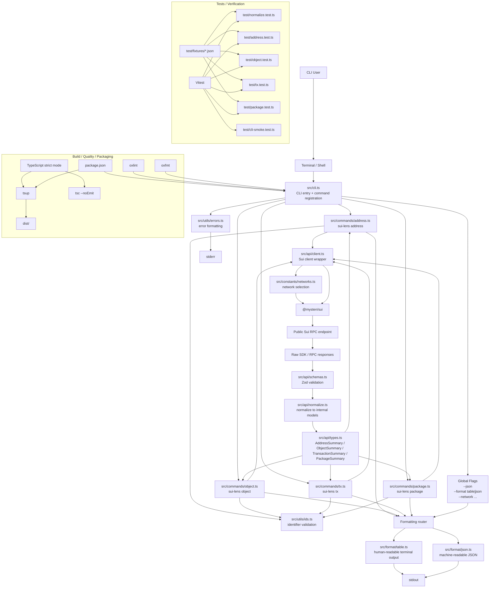

# Architecture

This diagram shows the planned architecture for `sui-lens` based on the current PRD and task list.

It reflects the intended flow from CLI input to command handling, Sui SDK access, normalization, formatting, and final terminal or JSON output.

## Summary

The architecture is organized into three layers:

- CLI interaction and command routing
- data access, normalization, validation, and formatting
- testing, quality checks, and packaging

The key design principle is to keep raw SDK access separate from command logic and output formatting so the codebase stays easier to test, maintain, and extend.
